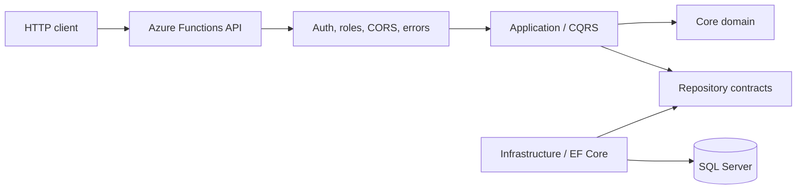

<div align="center">
  

  # Exchange Platform Backend

  **Technical challenge developed as part of a selection process for Banco de Crédito del Perú (BCP).**

  [](https://github.com/mbarretot/bcp-exchange-platform-backend/actions/workflows/ci.yml)
  
  
  
</div>

> [!IMPORTANT]
> This is an independent portfolio project created for a technical challenge. It is not an official BCP product, is not maintained by BCP, and contains no production data or credentials.

## What this project demonstrates

This backend exposes HTTP APIs for maintaining exchange rates and hierarchical business parameters. It applies Clean Architecture boundaries, CQRS with MediatR, domain-oriented entities, repository and Unit of Work patterns, validation pipelines, SQL Server persistence, and role-aware Azure Functions middleware.

### Main capabilities

- Create, update, soft-delete, and query exchange rates.
- Maintain reusable, hierarchical parameters such as currencies.
- Protect write operations with an `Admin` role requirement.
- Return application results through centralized validation and exception handling.
- Run automated formatting, build, test, and publish checks in GitHub Actions.

## Architecture



| Project | Responsibility |
| --- | --- |
| `Bcp.Exchange.Core` | Domain entities, errors, results, and persistence contracts |
| `Bcp.Exchange.Application` | Commands, queries, handlers, DTOs, validation, and mapping |
| `Bcp.Exchange.Infrastructure` | Entity Framework Core, repositories, migrations, and Unit of Work |
| `Bcp.Exchange.FunctionApp` | HTTP endpoints, middleware, authorization, and dependency composition |
| `Bcp.Exchange.UnitTests` | Application behavior and validation tests |
| `Bcp.Exchange.IntegrationTests` | Integration-test project scaffold |

The dependency direction remains inward: the domain has no framework dependencies, while infrastructure and delivery mechanisms depend on domain abstractions.

## Technology stack

- .NET 8 and C#
- Azure Functions v4, isolated worker model
- Entity Framework Core with SQL Server
- MediatR for CQRS dispatch
- FluentValidation for input validation
- Mapster for object mapping
- xUnit, FluentAssertions, and NSubstitute
- Application Insights integration

## Quick start

### Prerequisites

- [.NET 8 SDK](https://dotnet.microsoft.com/download/dotnet/8.0)
- [Azure Functions Core Tools v4](https://learn.microsoft.com/azure/azure-functions/functions-run-local)
- SQL Server or a compatible SQL Server container
- `dotnet-ef` for applying migrations

### 1. Configure local settings

```bash
cp src/Bcp.Exchange.FunctionApp/local.settings.json.example \
   src/Bcp.Exchange.FunctionApp/local.settings.json
```

Update `SqlConnectionString` in the copied file for your SQL Server instance. Never commit `local.settings.json`.

### 2. Restore and prepare the database

```bash
dotnet restore

cd src/Bcp.Exchange.Infrastructure
dotnet ef database update
cd ../..
```

### 3. Run the API

```bash
cd src/Bcp.Exchange.FunctionApp
func start
```

The local API is available at `http://localhost:7071/api` by default. Visual Studio launch settings use port `7214`.

### 4. Verify the solution

```bash
dotnet build --configuration Release
dotnet test --configuration Release
dotnet format --verify-no-changes
```

## API surface

| Method | Route | Purpose | Required application role |
| --- | --- | --- | --- |
| `GET` | `/api/exchange-rates` | List active exchange rates | None |
| `GET` | `/api/exchange-rates/{id}` | Get an exchange rate | None |
| `POST` | `/api/exchange-rates` | Create an exchange rate | `Admin` |
| `PUT` | `/api/exchange-rates/{id}` | Update an exchange rate | `Admin` |
| `DELETE` | `/api/exchange-rates/{id}?modifiedBy=...` | Soft-delete an exchange rate | `Admin` |
| `GET` | `/api/parameters` | List active parameters | None |
| `GET` | `/api/parameters/by-parent?parentCode=...` | List children of a parameter | None |
| `POST` | `/api/parameters` | Create a parameter | `Admin` |
| `PUT` | `/api/parameters/{id}` | Update a parameter | `Admin` |
| `DELETE` | `/api/parameters/{id}?modifiedBy=...` | Soft-delete a parameter | `Admin` |

HTTP triggers use Azure Functions' `Function` authorization level. Depending on the host environment, clients may also need an `x-functions-key` header or `code` query parameter.

### Example request

```bash
curl --request POST 'http://localhost:7071/api/exchange-rates' \
  --header 'Content-Type: application/json' \
  --header 'Authorization: Bearer <token-with-admin-role>' \
  --data '{
    "rate": 3.75,
    "currencySourceId": "11111111-1111-1111-1111-111111111111",
    "currencyTargetId": "22222222-2222-2222-2222-222222222222",
    "createdBy": "candidate@example.com"
  }'
```

## Security and production readiness

This repository represents a bounded technical challenge, not a production banking system. The current authentication middleware reads JWT claims but does **not** perform cryptographic token validation. Before production use, validate issuer, audience, signature, lifetime, and signing keys with the platform authentication layer or `Microsoft.Identity.Web`.

Additional production work would include integration-test coverage, secrets management, rate limiting, health checks, API versioning, OpenAPI documentation, audit logging, and deployment-specific observability.

## Repository notes

- CI runs formatting verification, restore, release build, tests, and Function App publishing.
- Deletes are logical (`IsActive = false`) to preserve historical records.
- The local CORS policy currently allows `http://localhost:4200`.
- Migrations are stored under `Bcp.Exchange.Infrastructure/Persistence/Migrations`.

## Legal notice

Source code is available under the [MIT License](LICENSE). The BCP name and logo belong to their respective owner and are used only to identify the context of the technical challenge; see [NOTICE](NOTICE.md).
